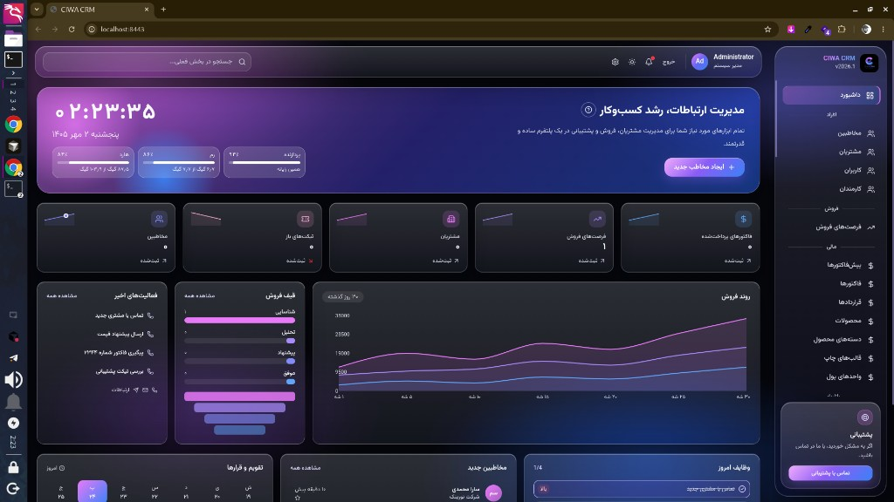
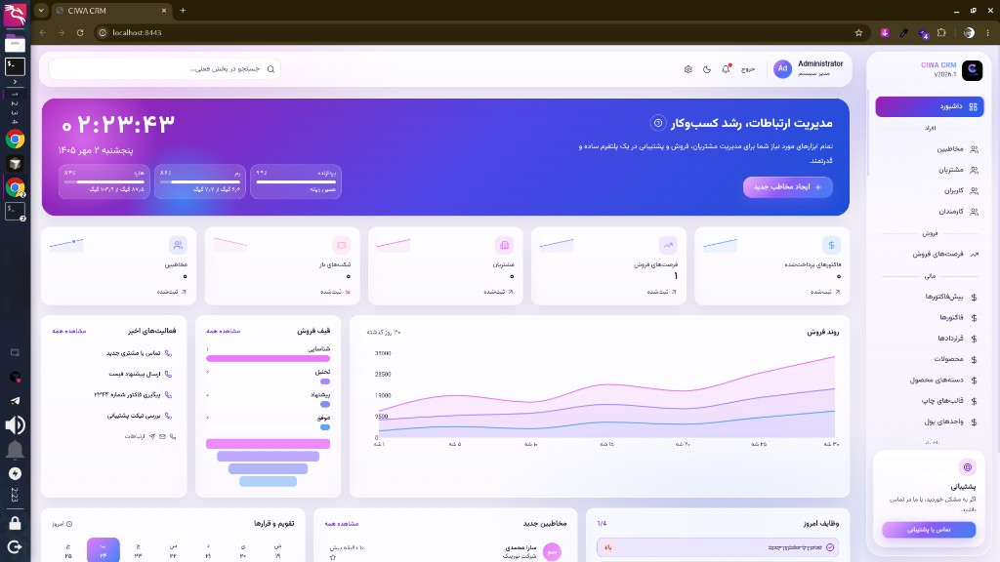

# CIWA CRM

مدیریت ارتباط با مشتری، با رابط شیشه‌ای فارسی و هستهٔ متن‌باز.

**CIWA CRM یک پروژهٔ کاملاً متن‌باز و رایگان است و تحت مجوز [GNU AGPLv3](https://www.gnu.org/licenses/agpl-3.0.html) منتشر می‌شود.** استفاده از آن هزینه‌ای ندارد. هر کسی می‌تواند آن را رایگان نصب کند، برای سازمان یا محصول خودش توسعه بدهد، تغییر بدهد و نسخهٔ تغییریافته را هم — با همین مجوز — دوباره منتشر کند. کد منبع همین نسخه‌ای که اجرا می‌شود باید در دسترس بماند.

برای **سلف‌هاستینگ** و **فروش خدمات** (نصب، میزبانی، پشتیبانی و توسعه) به سایت پروژه سر بزنید:

**[https://crm.ciwa.ir](https://crm.ciwa.ir)**

## نمای رابط

حالت تیره و حالت روشن هر دو بخشی از رابط هستند و انتخاب کاربر ذخیره می‌شود.

حالت تیره:



حالت روشن:



## این نرم‌افزار چیست

CIWA لایهٔ محصول است و پوشهٔ `core` هسته. رابط پیش‌فرض هسته جایگزین شده، ولی موتور CRM بازنویسی نشده است. مرورگر فقط با API رسمی JSON:API نسخهٔ ۸ حرف می‌زند و به پایگاه داده وصل نمی‌شود.

| بخش | نقش |
| --- | --- |
| `frontend/` | رابط React، راست‌به‌چپ، با فونت وزیرمتن |
| `integration/` | میان‌افزار ورود و پروکسی API؛ رمز کلاینت سمت سرور می‌ماند |
| `core/` | هستهٔ CRM، نسخهٔ ۷.۱۵.۲، مجوز AGPLv3 |
| `addons/` | ماژول‌های آماده: کاتالوگ خدمات، باشگاه مشتریان، نظرسنجی |
| `deploy/` | تصویر Docker و نصب خاموش هسته |

## امکانات

منو بر اساس کار روزانه گروه‌بندی شده است. هر بخش فهرست، ساخت، ویرایش و حذف دارد و کنار عنوانش علامت سؤال است: توضیح کوتاه همان بخش و یک آموزش سه‌مرحله‌ای.

### داشبورد

ساعت و تاریخ شمسی بالای سمت چپ هیرو است. زیر آن، مصرف پردازنده، رم و هارد همین رایانه در یک ردیف نشان داده می‌شود. بقیهٔ نما: شمارش مخاطبین، تیکت‌های باز، مشتریان، فرصت‌های فروش، فاکتورهای پرداخت‌نشده و محصولات؛ روند فروش؛ قیف فروش؛ فعالیت‌های اخیر؛ وظایف امروز؛ مخاطبان تازه؛ تقویم.

روشنایی با آیکون خورشید و ماه در نوار بالا عوض می‌شود و انتخاب کاربر می‌ماند. در عرض کم، منو به کشو تبدیل می‌شود و پنجره‌ها وسط صفحه باز می‌شوند.

### افراد

مخاطبین، مشتریان، کاربران و کارمندان.

### فروش

فرصت‌های فروش، با مبلغ، مرحله و احتمال.

### مالی

پیش‌فاکتورها، فاکتورها، قراردادها، محصولات، دسته‌های محصول، قالب‌های چاپ و واحدهای پول.

### بازاریابی

سرنخ‌ها، مخاطبان هدف، کمپین‌ها، فهرست‌های هدف، ایمیل‌ها، قالب‌های ایمیل و ارسال‌های کمپین.

### فعالیت‌ها

وظایف، قرارها، تماس‌ها با مدت به ساعت و دقیقه، یادداشت‌ها، اسناد، رویدادها، مکان‌های رویداد و تغییر زمان تماس.

### پشتیبانی مشتریان

تیکت‌ها، پایگاه دانش، دسته‌های دانش، نظرسنجی‌ها، سؤال‌ها، پاسخ‌ها و اشکالات.

کارت پشتیبانی پایین منو جدا از این فهرست است: آموزش، حداقل‌های نصب، تماس با کارشناسان، گفتگوی آنلاین، گزارش اشکال و درخواست امکانات.

### پروژه‌ها

پروژه‌ها، وظایف پروژه، قالب‌های پروژه و قالب‌های وظیفه.

### گزارش و پیگیری

گزارش‌ها، گزارش‌های زمان‌بندی‌شده، نقشه‌ها، مناطق و نشانگرهای نقشه، نمای مدیریتی، جریان فعالیت، هشدارها، علاقه‌مندی‌ها و جستجوهای ذخیره‌شده.

### مدیریت سامانه

گردش‌های کار، نقش‌ها، گروه‌های دسترسی، ساعات کاری، کارهای زمان‌بندی‌شده، ایمیل خروجی و ایمیل ورودی. رمز حساب ایمیل در رابط نوشته نمی‌شود.

### ماژول‌های اضافه

نصب مثل افزونه است: از کاتالوگ آماده، یا با فرستادن `module.json` یا یک زیپ که همین فایل را دارد. حذف، رکوردهای ذخیره‌شده را پاک نمی‌کند و نصب دوباره همان‌ها را برمی‌گرداند.

همراه نرم‌افزار این سه ماژول هست: کاتالوگ خدمات، باشگاه مشتریان و نظرسنجی مشتریان. تلفن درون‌برنامه‌ای هم به همین شکل نصب می‌شود؛ تماس‌ها روی همین دستگاه شبیه‌سازی می‌شوند و بستن پنجره آن را به آیکون کوچک گوشهٔ پایین چپ جمع می‌کند.

### هوش مصنوعی

تحلیل با کلید خود کاربر انجام می‌شود: آمار ماه شمسی، مدت تماس‌ها، فایل صوتی مکالمه، و پروندهٔ یک مخاطب. اگر سرویس سازگار دیگری باشد، نشانی آن هم در همان صفحه نوشته می‌شود. کلید در مرورگر برنمی‌گردد.

## اجرا روی سیستم خودتان

۱. فایل نمونه را کپی کنید و رمزها را عوض کنید. فایل `.env` وارد گیت نمی‌شود.

```bash
cp env.example .env
```

۲. پایگاه داده و هسته را بالا بیاورید:

```bash
docker compose up -d db crm
```

هسته روی `http://localhost:8081` در دسترس است.

۳. میان‌افزار و رابط CIWA را روی میزبان اجرا کنید. متغیرهای `CIWA_CORE_URL`، `CIWA_CLIENT_ID` و `CIWA_CLIENT_SECRET` را از `.env` بردارید.

```bash
node integration/server.mjs
```

```bash
cd frontend && pnpm install && pnpm dev
```

رابط CIWA روی `http://localhost:8443` باز می‌شود.

## مجوز

کل این پروژه، از جمله رابط CIWA و میان‌افزار، تحت **GNU Affero General Public License v3** است. متن مجوز هسته در [`core/LICENSE.txt`](core/LICENSE.txt) است.

معنای عملی این مجوز:

- استفاده، بررسی، تغییر و توسعه برای خودتان آزاد و رایگان است.
- می‌توانید نرم‌افزار را کپی کنید و در اختیار دیگران بگذارید.
- اگر نسخهٔ تغییریافته را روی سرور در اختیار کاربران می‌گذارید، باید کد منبع همان نسخه را هم به آن‌ها عرضه کنید.
- خدمات پیرامون نرم‌افزار — نصب، سلف‌هاستینگ، پشتیبانی و توسعه — جدا از خودِ نرم‌افزار است و از [crm.ciwa.ir](https://crm.ciwa.ir) ارائه می‌شود.

نرم‌افزار رایگان است. خدمات اختیاری است.
