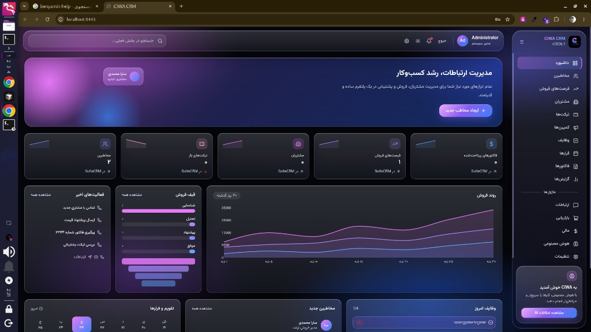
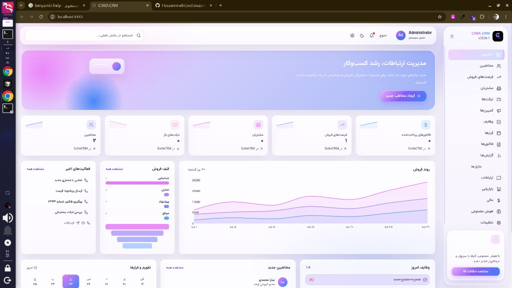

# CIWA CRM

مدیریت ارتباط با مشتری، با رابط شیشه‌ای فارسی و هستهٔ متن‌باز.

**CIWA CRM یک پروژهٔ کاملاً متن‌باز و رایگان است و تحت مجوز [GNU AGPLv3](https://www.gnu.org/licenses/agpl-3.0.html) منتشر می‌شود.** استفاده از آن هزینه‌ای ندارد. هر کسی می‌تواند آن را رایگان نصب کند، برای سازمان یا محصول خودش توسعه بدهد، تغییر بدهد و نسخهٔ تغییریافته را هم — با همین مجوز — دوباره منتشر کند. کد منبع همین نسخه‌ای که اجرا می‌شود باید در دسترس بماند.

برای **سلف‌هاستینگ** و **فروش خدمات** (نصب، میزبانی، پشتیبانی و توسعه) به سایت پروژه سر بزنید:

**[https://crm.ciwa.ir](https://crm.ciwa.ir)**

## نمای رابط

حالت تیره و حالت روشن هر دو بخشی از رابط هستند و انتخاب کاربر ذخیره می‌شود.

حالت تیره:



حالت روشن:



## این نرم‌افزار چیست

CIWA لایهٔ محصول است و پوشهٔ `core` هسته. رابط پیش‌فرض هسته جایگزین شده، ولی موتور CRM بازنویسی نشده است. مرورگر فقط با API رسمی JSON:API نسخهٔ ۸ حرف می‌زند و به پایگاه داده وصل نمی‌شود.

| بخش | نقش |
| --- | --- |
| `frontend/` | رابط React، راست‌به‌چپ، با فونت وزیرمتن |
| `integration/` | میان‌افزار ورود و پروکسی API؛ رمز کلاینت سمت سرور می‌ماند |
| `core/` | هستهٔ CRM، نسخهٔ ۷.۱۵.۲، مجوز AGPLv3 |
| `deploy/` | تصویر Docker و نصب خاموش هسته |

مخاطبین، مشتریان، سرنخ‌ها، فرصت‌های فروش، پیش‌فاکتورها، تیکت‌ها، کمپین‌ها، وظایف، قرارها، تماس‌ها، یادداشت‌ها، فاکتورها، قراردادها، محصولات و گزارش‌ها از همین رابط خوانده و نوشته می‌شوند.

## اجرا روی سیستم خودتان

۱. فایل نمونه را کپی کنید و رمزها را عوض کنید. فایل `.env` وارد گیت نمی‌شود.

```bash
cp env.example .env
```

۲. پایگاه داده و هسته را بالا بیاورید:

```bash
docker compose up -d db crm
```

هسته روی `http://localhost:8081` در دسترس است.

۳. میان‌افزار و رابط CIWA را روی میزبان اجرا کنید. متغیرهای `CIWA_CORE_URL`، `CIWA_CLIENT_ID` و `CIWA_CLIENT_SECRET` را از `.env` بردارید.

```bash
node integration/server.mjs
```

```bash
cd frontend && pnpm install && pnpm dev
```

رابط CIWA روی `http://localhost:8443` باز می‌شود.

## مجوز

کل این پروژه، از جمله رابط CIWA و میان‌افزار، تحت **GNU Affero General Public License v3** است. متن مجوز هسته در [`core/LICENSE.txt`](core/LICENSE.txt) است.

معنای عملی این مجوز:

- استفاده، بررسی، تغییر و توسعه برای خودتان آزاد و رایگان است.
- می‌توانید نرم‌افزار را کپی کنید و در اختیار دیگران بگذارید.
- اگر نسخهٔ تغییریافته را روی سرور در اختیار کاربران می‌گذارید، باید کد منبع همان نسخه را هم به آن‌ها عرضه کنید.
- خدمات پیرامون نرم‌افزار — نصب، سلف‌هاستینگ، پشتیبانی و توسعه — جدا از خودِ نرم‌افزار است و از [crm.ciwa.ir](https://crm.ciwa.ir) ارائه می‌شود.

نرم‌افزار رایگان است. خدمات اختیاری است.
